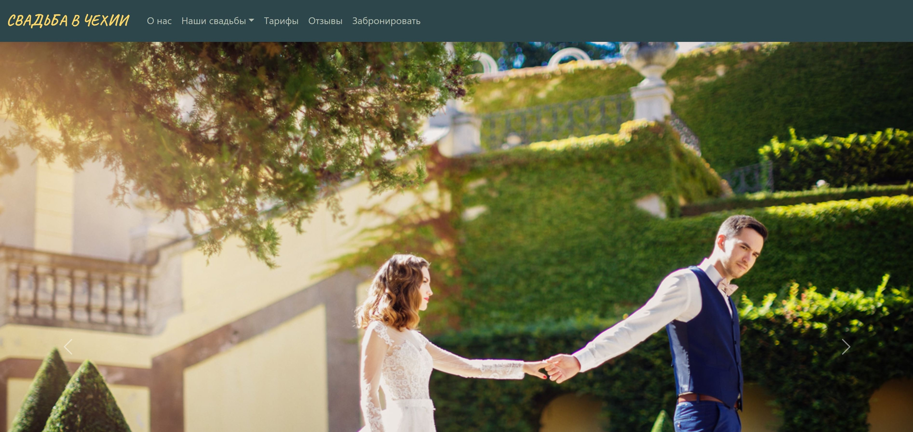
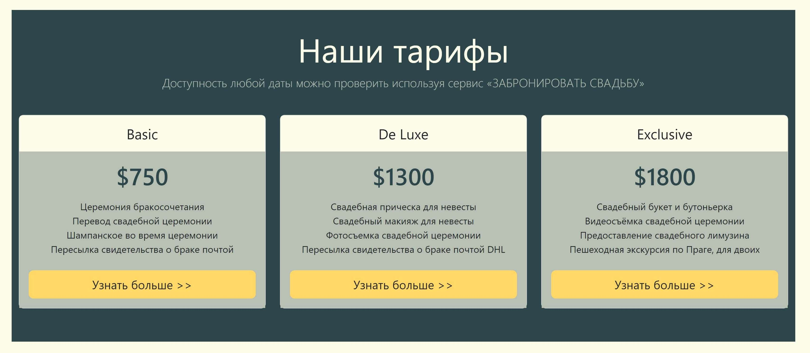
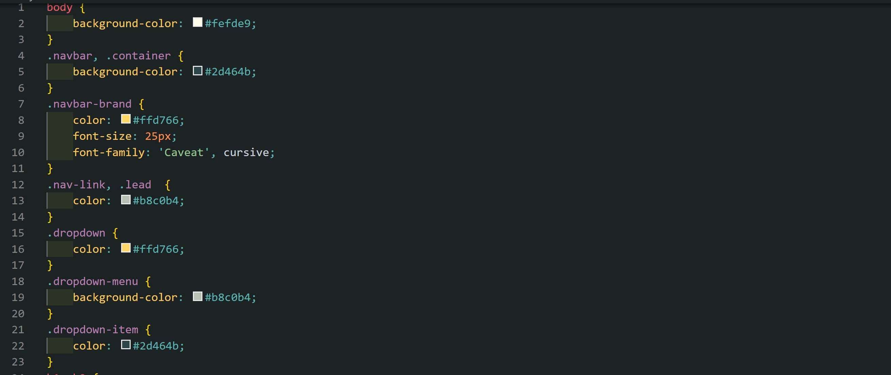
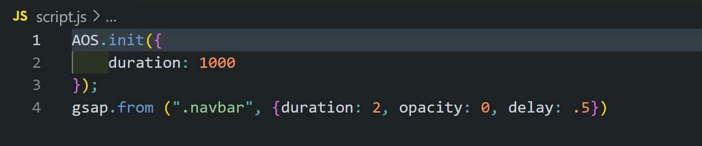

<a name="readme-top"></a>
<div>
  <h1 align="center">Hi there, I'm <a href="https://www.instagram.com/prostofil_ka/" target="_blank">Anna</a></h1>
</div>
<br />
<!-- PROJECT LOGO -->
<br />
<div align="center">
  <a href="https://github.com/Nyushaf/Wedding-in-czech-republic.git">
    
  </a>

  <h3 align="center">Wedding agency</h3>

  <p align="center">
    This is an unusual website of a wedding agency in Prague. 
       <br />
    <a href="https://github.com/Nyushaf/Wedding-in-czech-republic"><strong>Explore the docs »</strong></a>
    <br />
    <br />
    ·
    <a href="https://wedding-in-czech-republic.netlify.app">View Demo</a>
    ·
  </p>
  <a name="readme-top"></a>
</div>


<!-- TABLE OF CONTENTS -->
<details>
  <summary>Table of Contents</summary>
  <ol>
    <li>
      <a href="#about-the-project">About The Project</a>
      <ul>
        <li><a href="#built-with">Built With</a></li>
      </ul>
    </li>
    <li>
      <a href="#getting-started">Getting Started</a>
      <ul>
        <li><a href="#installation">Installation</a></li>
      </ul>
    </li>
    <li><a href="#usage">Usage</a></li>
    <li><a href="#limitations">Limitations</a></li>
    <li><a href="#contact">Contact</a></li>
  </ol>
</details>

<!-- ABOUT THE PROJECT -->
## About The Project



This is the website of a wedding agency. It contains 
* information about agency,
* the agency's services,
* tariffs,
* customer reviews,
* contact information.

 

<p align="right">(<a href="#readme-top">back to top</a>)</p>

### Built With

The following tools were used to create this project:

* 
* 
* 
* 

<p align="right">(<a href="#readme-top">back to top</a>)</p>

<!-- GETTING STARTED -->
## Getting Started

To get a local copy up and running follow these simple example steps.

### Installation

1. Copy link: <strong>https://github.com/Nyushaf/Wedding-in-czech-republic.git</strong>
2. Clone the repo 
   ```sh
   git clone https://github.com/Nyushaf/Wedding-in-czech-republic.git
   ```
3. If you copy the code separately, don't forget to provide links to third-party libraries.
   * For animation AOS
   ```sh
   <script src="https://unpkg.com/aos@2.3.1/dist/aos.js"></script>
   ```
   * For animation GSAP
   ```sh
   <script src="https://cdnjs.cloudflare.com/ajax/libs/gsap/3.11.5/gsap.min.js"></script>
   ```
   * For animation Bootstrap
   ```sh
   <script src="https://cdn.jsdelivr.net/npm/bootstrap@5.3.0-alpha1/dist/js/bootstrap.bundle.min.js" integrity="sha384-w76AqPfDkMBDXo30jS1Sgez6pr3x5MlQ1ZAGC+nuZB+EYdgRZgiwxhTBTkF7CXvN" crossorigin="anonymous"></script>
   ```

<p align="right">(<a href="#readme-top">back to top</a>)</p>


<!-- USAGE EXAMPLES -->
## Usage

Change parametrs CSS
   
<br />
<br />
And change parametrs AOS animation in HTML file (more information about it on [site](https://active-vision.ru/blog/animatsiya-pri-prokrutke/) )
   ```sh
   data-aos="fade-up"
   data-aos="zoom-in-up"
   ```
and GSAP animation in JS file

   <br />
   
<p align="right">(<a href="#readme-top">back to top</a>)</p>

<!-- LIMITATIONS -->
## Limitations

This site can be used for educational purposes. Do not forget to give a link to the original [source](http://www.luxesvadba.ru/).

<p align="right">(<a href="#readme-top">back to top</a>)</p>

<!-- CONTACT -->
## Contact

Anna Filina - [linkedin](https://www.linkedin.com/in/anyuta-filina-40a131265/) - nyushaf@gmail.com

Project Link: [https://github.com/Nyushaf/Wedding-in-czech-republic.git](https://github.com/Nyushaf/Wedding-in-czech-republic.git)

<p align="right">(<a href="#readme-top">back to top</a>)</p>
